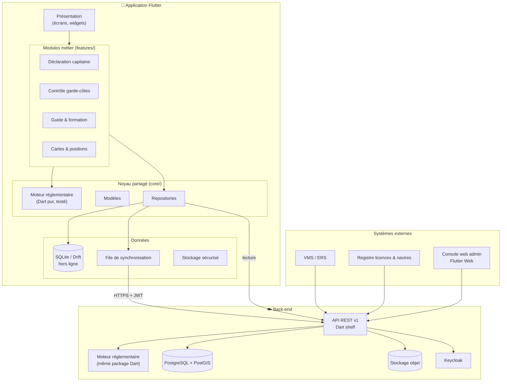
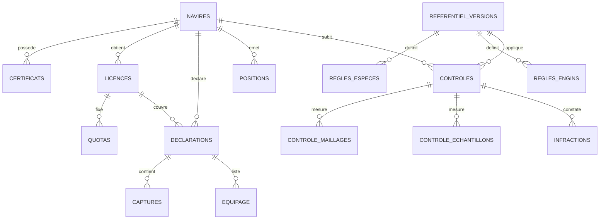

# Pêche Conforme — Plan technique

Application mobile universelle de pêche (artisanale, côtière, hauturière) pour la
Mauritanie : déclaration du capitaine, contrôle des garde-côtes, calcul
réglementaire et guide juridique. Stack : **Dart / Flutter**.

---

## 1. Choix techniques

| Couche | Choix | Pourquoi |
|---|---|---|
| Langage | **Dart 3** | Un seul langage pour le mobile, le web admin et (option) le serveur. |
| UI mobile | **Flutter 3** (Material 3) | Android + iOS + tablette avec un seul code. Android en priorité (parc majoritaire chez les pêcheurs et agents). |
| Gestion d'état | **Riverpod** (`flutter_riverpod`) | Testable, sans `BuildContext`, adapté aux flux hors ligne. |
| Navigation | **go_router** | Routes déclaratives + garde par rôle (capitaine / agent / admin). |
| Base locale | **Drift** (SQLite) | Requêtes typées en Dart, migrations, fonctionne 100 % hors ligne en mer. |
| Stockage sécurisé | `flutter_secure_storage` | Jetons d'authentification, clés de signature. |
| GPS | `geolocator` | Position + horodatage de chaque déclaration / contrôle. |
| Cartes | `flutter_map` + tuiles hors ligne (MBTiles) | Zones de pêche, aires protégées (PNBA), positions VMS sans réseau. |
| Photos / scan | `image_picker`, `mobile_scanner` | Photo d'échantillons, scan QR de la licence. |
| PDF | `pdf` + `printing` | Rapport d'inspection signé, imprimable / partageable. |
| HTTP | `dio` + `retrofit` | Intercepteurs (jeton, reprise), client généré depuis OpenAPI. |
| Sérialisation | `freezed` + `json_serializable` | Modèles immuables, `copyWith`, JSON. |
| Traduction | `flutter_localizations` + ARB | **Français, arabe (RTL), anglais**, + pictogrammes pour les pêcheurs peu alphabétisés. |
| Back-end | **Dart** (`shelf` + `postgres`), dossier `serveur/` du dépôt | Même langage que l'app : le moteur de règles Dart pourra être **partagé** entre app et serveur. |
| Base centrale | **PostgreSQL 16 + PostGIS** | Relations fortes, requêtes spatiales (navire dans une zone interdite ?). |
| Fichiers | Stockage objet S3-compatible (MinIO) | Scans de certificats, photos, rapports PDF. |
| Auth | **Keycloak** (OpenID Connect) | Rôles, comptes agents, révocation d'appareil. |
| Notifications | Firebase Cloud Messaging + SMS (passerelle locale) | Alertes quota / expiration de licence. |
| Intégrations | API VMS / ERS, registre des navires, système de licences | Recoupement déclaration ↔ position satellite. |
| CI/CD | GitHub Actions : `flutter analyze`, `flutter test`, build APK/AAB | Qualité à chaque commit. |

### API REST (extrait)

```
POST /auth/token                       → connexion (OIDC)
GET  /referentiel?depuis=2026.09       → règles (espèces, maillages, barèmes, zones)
GET  /navires?q=NKT-CH                 → recherche navire (immat., IMO, nom)
GET  /navires/{id}                     → fiche + certificats + licence active
GET  /navires/{id}/positions?depuis=   → historique VMS / AIS / app
POST /declarations                     → déclaration signée (idempotent sur l'UUID)
GET  /licences/{numero}/quotas         → quota consommé / restant
POST /controles                        → rapport d'inspection + mesures + infractions
POST /controles/{id}/pieces            → photos, PDF (multipart)
GET  /guide/textes                     → textes juridiques et fiches de formation
POST /v1/sync/{declarations|controles}/{id} → envoi de la file hors ligne (implémenté : serveur/)
```

Règles d'API : versionnée (`/v1`), **idempotente** (l'UUID est créé sur le
téléphone, un renvoi ne crée pas de doublon), contrat **OpenAPI** publié.

---

## 2. Architecture modulaire



### Structure des dossiers

```
lib/
├── main.dart
├── core/                      ← réutilisable par tous les modules
│   ├── models/                  navire, licence, déclaration, contrôle
│   ├── regulation/              référentiel, moteur de calcul, rapports texte et PDF
│   ├── data/                    base Drift, dépôts, file d'envoi
│   ├── services/                GPS, synchronisation avec l'API
│   └── widgets/                 composants communs
└── features/                  ← un dossier par module métier
    ├── accueil/
    ├── declaration/             déclaration du capitaine
    ├── controle/                contrôle garde-côtes
    └── guide/                   guide réglementaire + formation
```

**Principe clé** : le moteur réglementaire (`core/regulation/`) n'importe pas
Flutter. On peut le tester seul et l'exécuter tel quel sur le serveur, ce qui
garantit que l'app et le back-office appliquent **les mêmes règles**.

### Fonctionnement hors ligne

1. Au démarrage (avec réseau) : téléchargement du référentiel, des navires et
   licences de la zone de l'agent.
2. En mer : tout est écrit dans SQLite. Chaque enregistrement reçoit un UUID et
   entre dans une **file d'envoi**.
3. Au retour du réseau : `POST /v1/sync/...` envoie la file ; le serveur
   vérifie, enregistre et confirme (fait). Étape suivante : qu'il **recalcule**
   les infractions avec la même version du référentiel.
4. Conflits : le serveur fait foi pour les licences/quotas ; les déclarations
   et contrôles ne sont jamais écrasés (ajout seulement + journal d'audit).

### Différenciation par segment / engin

| Segment | Navires | Engins typiques | Particularités dans l'app |
|---|---|---|---|
| Artisanale | Pirogues | ligne, casier (poulpe), filet maillant | Interface simplifiée, pictogrammes, saisie vocale, pas d'IMO |
| Côtière | Senneurs, dragueurs | senne tournante, drague | Maillage, prises accessoires, zones côtières |
| Hauturière | Chalutiers, thoniers | chalut de fond / pélagique, senne | IMO, VMS obligatoire, quotas ICCAT, accord UE-Mauritanie, équipage |

Le **référentiel** associe à chaque engin son maillage minimal et son seuil de
prises accessoires, et à chaque espèce sa taille / poids minimal : ajouter un
engin ou une espèce ne demande **aucune modification de code**.

---

## 3. Schéma de base de données

Voir [`schema.sql`](schema.sql) (PostgreSQL + PostGIS, vérifié sur PostgreSQL 16).

Tables principales :



Points importants :
- **Référentiel versionné** : chaque contrôle garde la version des règles
  appliquée → valeur juridique du rapport même si la loi change ensuite.
- **UUID générés sur le téléphone** → synchronisation sans doublon.
- **PostGIS** → « ce navire était-il dans une zone interdite à son engin ? ».
- **audit_log** → traçabilité de toute modification.

---

## 4. Prototypes d'écrans

Implémentés et testés dans ce dossier :

- `lib/features/declaration/declaration_capitaine_screen.dart`
  Assistant en 4 étapes : **Navire & licence** (certificats en vert/rouge,
  position GPS) → **Équipage** → **Captures** (cible / accessoire) →
  **Vérification** (quotas, % prises accessoires, infractions, amende
  indicative) → *Signer et envoyer*.
- `lib/features/controle/controle_agent_screen.dart`
  Fiche d'inspection : **Navire** (pavillon, marquage) → **Certificats** →
  **Engin & maillage** (mesures multiples, tolérance) → **Échantillons**
  (tailles minimales, individus non conformes en rouge) → **Plan de stockage**
  → résultat en direct → **rapport automatique**.

```
┌──────────────────────────────┐   ┌──────────────────────────────┐
│ ← Déclaration du capitaine   │   │ ← Contrôle garde-côtes       │
├──────────────────────────────┤   ├──────────────────────────────┤
│ ① Navire & licence           │   │ 🚢 1. Navire                 │
│   [Atlantic Star — Chalutier▾]│   │   [Atlantic Star (NKT-CH..)▾]│
│   [Chalut de fond          ▾]│   │   Pavillon ESP · 42 m        │
│   Licence  LIC-UE-2026-0012  │   │   ◉ Pavillon concordant      │
│   GPS      20.8500°,-17.4500°│   │   ◉ Marquage visible         │
│   ✅Navigabilité ❌Sanitaire  │   │ 📄 2. Certificats  ✅ ❌ ✅    │
│ ② Équipage (3)               │   │ ▦ 3. Maillage  min 70 mm     │
│ ③ Captures (2)               │   │   [ 62 ] (+)   62mm 64mm     │
│ ④ Vérification               │   │ 📏 4. Échantillons           │
│   Poids total   1 200 kg     │   │   [Sole — min 24 cm ▾]       │
│   Prises acc.   8,3 %        │   │   SOL 22  SOL 26  SOL 25     │
│   ⚠ 1 non-conformité         │   │ 📦 5. Stockage  ◉ conforme   │
│   Amende 50 000–200 000 MRU  │   │ ⚠ 3 non-conformités          │
│ [ Signer et envoyer ]        │   │ [ 📄 Générer le rapport ]    │
└──────────────────────────────┘   └──────────────────────────────┘
```

---

## 5. Étapes de développement

| Phase | Durée indicative | Contenu | Livrable |
|---|---|---|---|
| **0. Cadrage** | 3–4 sem. | Ateliers avec ministère, garde-côtes, armateurs, pêcheurs artisanaux. Collecte **officielle** des textes et barèmes. Choix d'hébergement (données souveraines). | Cahier des charges, référentiel v1 validé juridiquement |
| **1. Socle** | 4 sem. | Projet Flutter, CI, auth Keycloak, Drift, API squelette, PostgreSQL. | App qui se connecte et synchronise un navire |
| **2. Référentiel + moteur** | 3 sem. | Moteur de règles (déjà prototypé ici), tests sur cas réels fournis par les juristes. | Package `regulation` testé à 100 % |
| **3. Déclaration capitaine** | 5 sem. | Écrans, hors ligne, signature, GPS, scan licence. | Pilote avec 1 armement + 1 coopérative artisanale |
| **4. Module garde-côtes** | 6 sem. | Inspection, photos, PDF signé, recherche navire, positions VMS. | Pilote avec une brigade (Nouadhibou) |
| **5. Guide & formation** | 3 sem. | Textes, fiches espèces illustrées, quiz de formation continue. | Contenu validé |
| **6. Console web** | 4 sem. | Flutter Web : tableaux de bord, quotas, statistiques. | Back-office |
| **7. Pilote terrain** | 8 sem. | Retours utilisateurs, corrections, traduction arabe complète. | Version 1.0 |
| **8. Déploiement** | continu | Formation des formateurs, support, mises à jour du référentiel. | Généralisation |

---

## 6. Recommandations pratiques

1. **Hors ligne d'abord** : en mer il n'y a pas de réseau. Tester l'app en mode
   avion dès le premier jour.
2. **Ne jamais coder une valeur légale en dur** : tout passe par le référentiel
   versionné et validé par un juriste. Les valeurs du prototype sont
   **fictives**.
3. **Valeur probante** : horodatage, GPS, signature numérique, photos, journal
   d'audit, version du référentiel dans chaque rapport.
4. **Accessibilité terrain** : gros boutons (gants, embruns), fort contraste
   (soleil), arabe + français, pictogrammes et audio pour l'artisanal.
5. **Matériel** : tablettes durcies IP68 pour les agents ; Android 8+ minimum.
6. **Sécurité** : chiffrement SQLite (SQLCipher), révocation à distance d'un
   appareil perdu, rôles stricts (un capitaine ne voit que ses navires).
7. **Données personnelles** : équipage = données personnelles → minimisation,
   durée de conservation définie, hébergement conforme à la loi mauritanienne.
8. **Interopérabilité** : formats FAO (codes ASFIS), ERS UE pour les navires
   sous accord, export CSV/JSON pour les statistiques.
9. **Qualité** : chaque règle = au moins un test unitaire ; `flutter analyze`
   et `flutter test` obligatoires en CI.
10. **Commencer petit** : un segment (ex. poulpe artisanal à Nouadhibou) en
    pilote, puis étendre.
